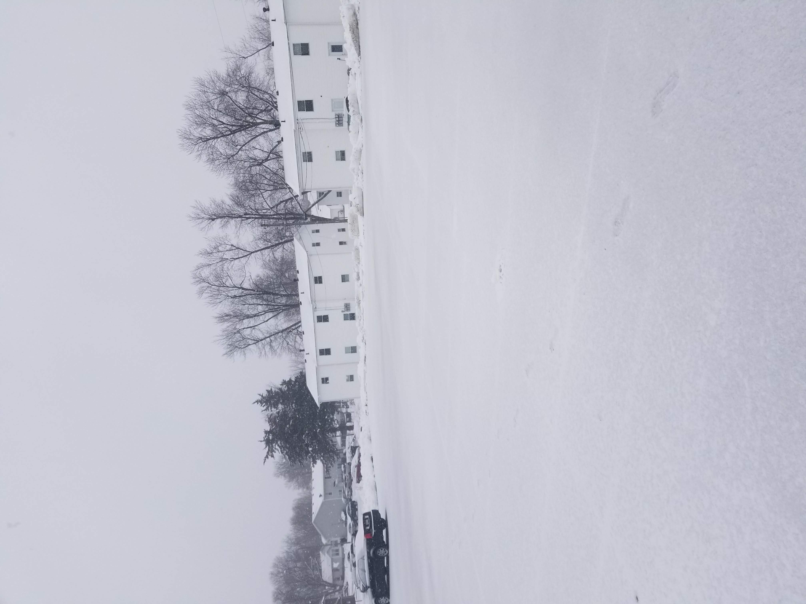

doc

# Val_aboutme

## Links
* [My Webpage](https://github.com/Valoderah)
* [Source](https://valoderah.github.io/Val_aboutme/)

## About this repository
- My name is Valentine Osakwe and I am a computer Science Major
This repository will be used to learn how to wite and set up a repository as well as how to begin a web page development. So far I have a contact page set up, an interactive page set up with ajax. I will add more as times go by. 
Please feel free to visit and critique.

## Recommended

- [HTML](https://www.w3schools.com/html/) - This language is used to setup a web-page.
- [CSS](https://www.w3schools.com/css/) - CSS is a style that describes the style of an HTML document
- [Javascript](https://www.javascript.com/) - Javascript is the programming language for HTML and the web

## Recommended Resources

- [Stack Overflow](https://stackoverflow.com/) - Its a website where you hav geeks answer your questions or you see what other people have done
- [w3 Schools](https://www.w3schools.com/) - It is a cheat sheet web where people can understand basic coding syntax's.
- [Git Hub](https://github.com/) - it is a free and open source distributed version control system.

## Contributors and sources

 
 

picture:https://meta.discourse.org/t/stackblur-backgrounds/79344
ajax:  https://www.w3schools.com/jquery/ajax_ajax.asp , https://openclassrooms.com/en/courses/3523261-use-javascript-in-your-web-projects/3759261-make-your-first-ajax-request
